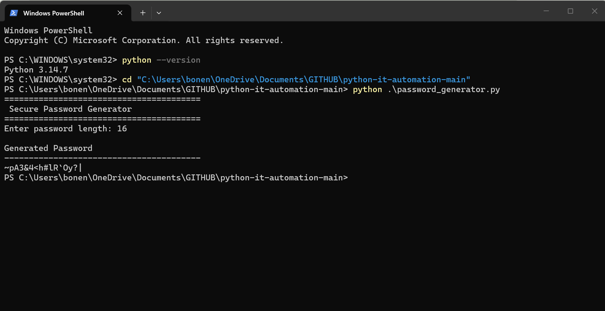

# Python IT Automation


## Overview

This repository contains Python automation scripts designed to support common IT tasks, improve efficiency, and demonstrate practical scripting skills.

The projects in this repository focus on automation, file handling, data processing, user input validation, and secure coding practices.

---

## Table of Contents

- [Overview](#overview)
- [Repository Structure](#repository-structure)
- [Python Scripts](#python-scripts)
- [Script Demonstration](#script-demonstration)
- [Project Goals](#project-goals)
- [Skills Demonstrated](#skills-demonstrated)
- [Technologies Used](#technologies-used)
- [Repository Status](#repository-status)
- [Future Improvements](#future-improvements)
- [About Me](#about-me)

---

## Repository Structure

```text
python-it-automation/
│
├── Screenshots/
│   ├── password-generator.png
│   └── README.md
│
├── password_generator.py
├── HOW-TO-RUN.md
├── LICENSE
└── README.md
```

---

## Python Scripts

### Secure Password Generator

The `password_generator.py` script generates secure random passwords using Python's built-in `secrets` module.

### Features

- Generate cryptographically secure passwords
- User-defined password length
- Includes uppercase and lowercase letters
- Includes numbers
- Includes special characters
- Built using Python's `secrets` module
- Beginner-friendly and easy to modify

---

## How to Run

Clone the repository:

```bash
git clone https://github.com/Bonenixon0824/python-it-automation.git
```

Navigate into the project:

```bash
cd python-it-automation
```

Run the script:

```bash
python password_generator.py
```

---

## Script Demonstration

📂 **Screenshots Folder:** [`Screenshots`](./Screenshots)

The screenshot below demonstrates successful execution of the password generator.

### Secure Password Generator



*This example shows the script generating a secure 16-character password using Python's `secrets` module.*

---

## Project Goals

This project was created to:

- Practice Python programming
- Automate common IT-related tasks
- Build secure and reusable scripts
- Improve error handling and input validation
- Develop a professional technical portfolio
- Demonstrate practical automation skills

---

## Skills Demonstrated

- Python Fundamentals
- Functions
- User Input
- Input Validation
- Error Handling
- Secure Coding
- String Manipulation
- Automation
- Technical Documentation
- Git & GitHub

---

## Technologies Used

- Python 3
- Python `secrets` module
- Python `string` module
- Windows PowerShell
- Git
- GitHub

---

## Repository Status

| Component | Status |
|-----------|--------|
| Password Generator | ✅ Complete |
| Testing | ✅ Complete |
| Documentation | ✅ Complete |
| Screenshot | ✅ Complete |
| Additional Scripts | 🚧 Planned |

---

## Future Improvements

- File Organizer
- Disk Usage Checker
- Log File Parser
- CSV Report Generator
- Network Ping Tool
- Backup Automation
- System Information Reporter
- Duplicate File Finder

---

## About Me

Hi, I'm **Nixon Bone**.

I hold a Bachelor of Science in Information Technology with a concentration in Cybersecurity and have professional experience in technical support. I build hands-on projects in Python, PowerShell, networking, SQL, and Windows administration to strengthen my automation and technical problem-solving skills while expanding my knowledge of systems administration and cybersecurity.

## Connect With Me

- **LinkedIn:** https://linkedin.com/in/nixon-bone-6abab2374
- **GitHub:** https://github.com/Bonenixon0824
